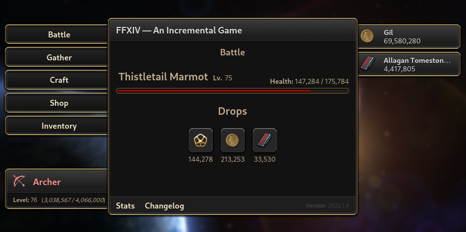

<div align="center">
  
  <h1 align="center">FFXIV &mdash; An Idle Game</h1>

  **FFXIV &mdash; An Idle Game** is an idle game based on Final Fantasy XIV, comprised of features that have been adapted to be automatic, where you, the player, level up Job Classes, defeat FFXIV mobs, gather materials, and more.

  
  
  
  
  <a href="https://hits.seeyoufarm.com">
    
  </a>
</div>


## Table of Contents
- [Table of Contents](#table-of-contents)
- [About The Project](#about-the-project)
  - [Screenshots](#screenshots)
  - [Tech Stack](#tech-stack)
  - [Features](#features)
- [Getting Started](#getting-started)
  - [Prequisites](#prequisites)
  - [Installation](#installation)
- [License](#license)


## About The Project
### Screenshots
<div align="center">
  
</div>

### Tech Stack
- Typescript
- React

### Features
- Tick-based automatic mechanics
- Mob Battlings
- Material Gathering
- Gear Crafting
- Stat Tracking


## Getting Started
### Prequisites
This project uses the **Yarn** package manager.

```bash
npm i -g yarn
```

### Installation
Clone the repository, open a terminal into the repository's location, install the scripts, and run **Vite**.

```bash
## Clone via HTTPS
# git clone https://github.com/Toxocious/FFXIV-Idle.git

## Clone via SSH
# git clone git@github.com:Toxocious/FFXIV-Idle.git

## CD into the repository directory
cd FFXIV-Idle

## Install all needed modules.
yarn install

## Run Vite
yarn dev
```


## License
Licensed under GNU GPL 3.

For more information, check out [LICENSE](LICENSE).
